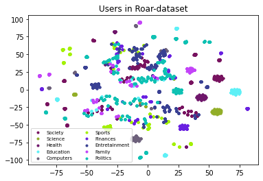

# Roar-dataset

[To get the Roar dataset .csvs, view releases](https://github.com/Roar-Network/roar-dataset/releases)

It was necesary to create an artificial dataset to train three (3) essential Roar Network components:

- the classifier of roars
- the recommenders of roars
- the sentiment analizer of roars

Roar dataset is based on Yahoo Answers Topic. Each roar belongs to one of the following categories:

1. Society & Culture
2. Science & Math
3. Health
4. Education
5. Computer & Internet
6. Sports
7. Business & Finance
8. Entretainment
9. Family
9. Governemnt & Politic

## How was created Roar dataset?

> A roar is a short text with a maximun of 512 characters.

Then, as step number one, we take as a roar each title + answer of Yahoo Answer Topic, but just those with a maximun of 512 characters.

In addition,it was created a preference probabilistic graph, which represent the probability of user `A` which like category `m`, like category `n`, where `n != m`.

So, we generated 5000 users. A user is created by adding an array of random preferences `k` with different main categories.

Then, the categories that the user likes the most are selected, and they select random roar and they are rated.

## Exploratory Data Analysis

The image below represent a visualization of users preference in two dimension using no-supervised algorithm t-distributed Stochastic Neighbor Embedding.
